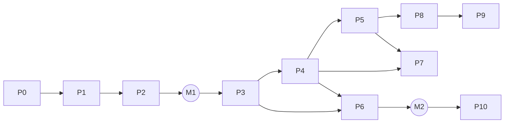

# Kế hoạch thực hiện kiến trúc tích hợp DVH Office

Nguồn: `DVH_Office_Ke_hoach_trien_khai_kien_truc.docx` (bản định hướng 01/10/2026).
Ngày đánh giá: 01/10/2026. Phạm vi đối chiếu: mã nguồn repo trên nhánh `main`, gồm cả các thay đổi chưa commit.
Tài liệu gồm hai phần: (1) đánh giá bản định hướng có hợp với codebase không, (2) kế hoạch thực hiện chi tiết đã điều chỉnh.

---

## 0. Kết luận ngắn

**Về định hướng thì đúng, và codebase đã đi được một phần đường đó.** Docs, Sheets và Slides đều đã có
bộ thao tác chuẩn hoá: lô thao tác được kiểm tra trước, chạy như một transaction, hoàn tác bằng một
lần Undo, có chạy thử (dry run) và đánh dấu nguồn (`ai`/`ui`). AI đã độc lập với nhà cung cấp, shell đã
có MCP server điều khiển cả ba ứng dụng. Nguyên tắc "AI, Recorder và Script cùng gọi một Action API"
vì thế khớp với cách code đang được tổ chức.

**Nhưng chưa thể làm theo nguyên trạng.** Cần 5 điều chỉnh:

1. **Lưu mô hình DVH bên trong OOXML**: dùng phần `customXml`, content control (`w:sdt`) và defined
   name ẩn. Định dạng gói riêng ở mục 12 của bản gốc nên hoãn lại. Toàn bộ đường lưu file hiện tại là
   vá OOXML giữ nguyên byte; người dùng QLCL lại phải gửi file Word/Excel cho chủ đầu tư và tư vấn giám sát.
2. **Đưa change-set và mô tả Action tối thiểu vào Phase 0.** History xây trên change-set, nên đảo thứ tự
   "History → Action API" của bản gốc thành "Action Core → History".
3. **Đưa Smart Template và sinh hồ sơ hàng loạt lên ngay sau Data Link và Action Core.** Đây là phần
   mang lại giá trị lớn nhất cho QLCL. AI Actions dạng kế hoạch phẳng cũng nên làm trước Recorder và Script.
4. **DVH-Script là cách viết bằng chữ của Workflow Model**, chạy bằng trình thông dịch model, không
   `eval`. Chỉ thiết kế ngôn ngữ khi workflow model đã ổn định.
5. **Lõi DVH nằm trong các package mới**, chỉ móc vào ứng dụng qua những điểm nối mỏng. Repo là bản
   fork của `genspark-ai/genoffice` và đang đồng bộ upstream định kỳ; sửa sâu vào các file lớn sẽ
   gây xung đột mỗi lần đồng bộ.

**Việc bắt buộc trước mọi phase:** toàn bộ phần DVH (các file `dvh-*` và 178 file đã sửa) **chưa được
commit**. Một chương trình kéo dài nhiều tháng không thể đứng trên một working tree chưa có lịch sử.
Nhánh `main` đang theo dõi `upstream/main` (genoffice), nên commit DVH nằm trên nhánh riêng `dvh/main`.
Code lưu tại ổ D, không có remote (mục 12).

Các quyết định của chủ dự án ngày 01/10/2026 đã được đưa vào tài liệu này (xem mục 12).

---

## 1. Hiện trạng codebase so với từng lớp của kế hoạch

| Lớp (bản gốc)               | Đã có trong code                                                                                                                                                                                                                                                                                                                                                                                                                                                                                                | Khoảng trống                                                                                                                                     | Mức sẵn sàng                                     |
| --------------------------- | --------------------------------------------------------------------------------------------------------------------------------------------------------------------------------------------------------------------------------------------------------------------------------------------------------------------------------------------------------------------------------------------------------------------------------------------------------------------------------------------------------------- | ------------------------------------------------------------------------------------------------------------------------------------------------ | ------------------------------------------------ |
| **Smart Data / Identity**   | Định danh ổn định chỉ có ở Slides (`slideId` do executor gán). Docs dùng mốc `docxIndex` để vá khi lưu, đây là vị trí chứ không phải ID. `project-store` có `chatIdByPath` giữ nguyên ID khi đổi tên hoặc di chuyển file.                                                                                                                                                                                                                                                                                       | Chưa có Field, Record, Collection; chưa có ID tài liệu; chưa có kho mô hình.                                                                     | Thấp                                             |
| **Binding ở Sheets**        | `xlsx-gateway/src/gateway/xlsx-defined-names.ts`, `NameManagerDialog.tsx`. Univer 0.25.1 có `UpdateDefinedNameController`, tự dời defined name khi chèn hoặc xoá hàng/cột.                                                                                                                                                                                                                                                                                                                                      | Chưa có quy ước tên ẩn cho binding; chưa kiểm khi workbook đang stream một phần.                                                                 | Trung bình                                       |
| **Binding ở Docs**          | `docx-engine` giữ nguyên vỏ SDT cấp khối (`SdtShell`: `tag`, `alias`, `controlType`) và đã ghi được phần `customXml` (danh mục tài liệu tham khảo, `patch.ts`, `sources.ts`). Có field ops kiểu Word (`ai/field-ops.ts`).                                                                                                                                                                                                                                                                                       | Chưa có SDT cấp dòng thành node TipTap riêng; chưa sinh `w:dataBinding`.                                                                         | Trung bình                                       |
| **DVH.Table**               | Có bảng docx sửa được (`editor/table-ops.ts`, `ai/table-ops.ts`), Format as Table của Univer (`preset-sheets-table`, `table-actions.ts`, `xlsx-table-add.ts`). Hàm `DVH.Table` hiện chỉ được đối chiếu với lệnh Format as Table (`docs/dvh-function-status.md`).                                                                                                                                                                                                                                                | Chưa có Table Model độc lập; chưa có renderer nào nhận model.                                                                                    | Thấp                                             |
| **Data Link**               | `apps/docs/src/main/external-change.ts` phát hiện file bị sửa từ bên ngoài. Shell có `file-index`, `open-documents`, `tab-manager` và kênh điều khiển `window.__genofficeControl` sang từng renderer.                                                                                                                                                                                                                                                                                                           | Chưa có Link Manager, cơ chế cập nhật hay xử lý xung đột.                                                                                        | Thấp, nhưng có hạ tầng                           |
| **Automation / Action API** | Docs: `ai/ops.ts` có registry kiểm cả lô, một transaction ProseMirror, một Undo, `source: 'ai' \| 'ui'`, `dryRun`, ghi theo track changes. Sheets: `WorkbookOperation` / `WorkbookCommandBatch` trong `xlsx-gateway/domain/workbook-dsl.ts` (có `dslVersion`, `transactionId`, `revision`) và `op-executor.ts` ("ribbon dùng cùng op với AI", một Undo mỗi lô). Slides: `runTxn` + `journaledTxn`. CLI: `op-catalog.ts` có schema và fingerprint. Shell MCP: `apply_ops`, `apply_sheet_ops`, `apply_slide_ops`. | Mỗi ứng dụng một catalog riêng; chưa có lớp quyền thống nhất; chưa có action cho Smart Data, Table hay Link; chưa có transaction xuyên ứng dụng. | **Khá**: khoảng một nửa đã có theo từng ứng dụng |
| **History**                 | Slides: `Session.opLog` (nguồn `edit/batch/script/generate/reset`, vòng 200 mục), Undo bằng snapshot. Docs: track changes, `compare.ts`, Undo của ProseMirror. Sheets: `edit-journal.ts` (vừa là dữ liệu lưu, vừa là lớp phủ khi stream).                                                                                                                                                                                                                                                                       | Chưa có lịch sử bền vững theo đối tượng, chưa có diff hay restore riêng một đối tượng.                                                           | Thấp                                             |
| **Record Anything**         | Op journal của Slides đã ghi thao tác có ngữ nghĩa, không ghi chuột (`docs/slides-op-journal.md`).                                                                                                                                                                                                                                                                                                                                                                                                              | Docs và Sheets chưa có một điểm duy nhất mà mọi thao tác đi qua; phần lớn lệnh ribbon chưa phát sự kiện ngữ nghĩa.                               | Thấp                                             |
| **DVH-Script**              | Tiền lệ ở Slides: `slides:apply-edit-script` biên dịch các thao tác cơ bản của script thành op rồi chạy một transaction. `dvh-evaluate.ts` có bộ phân tích biểu thức an toàn.                                                                                                                                                                                                                                                                                                                                   | Chưa có ngôn ngữ, trình soạn thảo hay sandbox.                                                                                                   | Rất thấp                                         |
| **AI Actions**              | `agent-core` (skill, tool, vòng ReAct), `ai-provider` (Claude/Gemini/DeepSeek/OpenAI/tuỳ chỉnh), `apps/sheets/src/ai/privacy-policy.ts` (`allow/redact/statistics-only/deny`), `dryRun` của Docs.                                                                                                                                                                                                                                                                                                               | AI đang gọi tool sửa trực tiếp, chưa qua bước Action Plan → Validator → Preview → Confirm theo chính sách.                                       | **Khá**                                          |
| **Document Generator**      | Đã xuất PDF không cần giao diện (`docs/headless-pdf-export.md`, `apps/shell/src/main/headless-export.ts`); CLI `create/convert/batch`.                                                                                                                                                                                                                                                                                                                                                                          | Chưa có template engine hay batch generator.                                                                                                     | Thấp                                             |
| **Định dạng lưu trữ**       | Docx: vá theo đoạn, giữ nguyên byte. Xlsx: edit journal, vá qua gateway và sidecar `xlsx-engine`.                                                                                                                                                                                                                                                                                                                                                                                                               | Thêm định dạng gói riêng nghĩa là thêm một đường lưu thứ ba cho mọi ứng dụng.                                                                    | Không nên làm sớm                                |

---

## 2. Đánh giá tính phù hợp

### 2.1 Giữ nguyên

- Tách **dữ liệu, hành động và giao diện**, định danh bằng ID chứ không bằng địa chỉ ô (mục 1, 2, 15).
- **Không xây API riêng cho AI.** AI chỉ lập kế hoạch; ứng dụng kiểm quyền, chạy thử, thực thi và ghi
  lịch sử (mục 7, 10). Hướng này trùng với cơ chế `dryRun` và `source` đang có.
- **Recorder ghi hành động ngữ nghĩa** (mục 8). Op journal của Slides đã chứng minh làm được.
- **DVH.Table là đối tượng, không phải Range mở rộng** (mục 4). Song song đó, `DVH.Table` dạng hàm vẫn
  được giữ và trả cả giá trị lẫn định dạng qua kênh mới (Phụ lục A, nhánh T1).
- **Template xây trên Data Link** (mục 11, 15).
- Tiêu chí kiểm thử ở mục 16: giữ cả 8 bài, gắn mỗi bài vào một phase (xem mục 7 dưới đây).

### 2.2 Cần điều chỉnh

| #   | Điểm trong bản gốc                                       | Vấn đề khi đặt vào codebase                                                                                                                                                    | Đề xuất                                                                                                                                                                                                                                             |
| --- | -------------------------------------------------------- | ------------------------------------------------------------------------------------------------------------------------------------------------------------------------------ | --------------------------------------------------------------------------------------------------------------------------------------------------------------------------------------------------------------------------------------------------- |
| A   | Mục 12: package DVH riêng, "không khoá vào OOXML"        | Cả Docs và Sheets lưu bằng cách vá file gốc để giữ nguyên byte. Định dạng mới buộc mọi tính năng phải viết thêm đường lưu thứ ba, và người nhận không mở được bằng Word/Excel. | Mô hình logic vẫn độc lập với định dạng, nhưng **chỗ lưu là OOXML**: `customXml` cho mô hình, `w:sdt` có `tag` và `w:dataBinding` cho Smart Field, defined name ẩn cho binding ở xlsx. Gói `.dvh` hoặc thư mục dự án để sang P10.                   |
| B   | Phase 4 History đứng trước Phase 5 Action API            | Lịch sử theo đối tượng là kết quả của dòng change-set. Làm History trước thì phải gắn ghi lịch sử vào mọi đường sửa, rồi làm lại lần nữa khi có Action API.                    | Phase 0 định nghĩa sẵn khung change-set và mô tả Action. Các phase sau, hành động nào cũng phát change-set. History (P5) chỉ cần đọc dòng này.                                                                                                      |
| C   | Smart Template ở Phase 8, AI ở Phase 9                   | Sinh biên bản hàng loạt là nhu cầu lớn nhất của QLCL và chỉ cần Smart Data + Table + Link. AI đã có sẵn hạ tầng.                                                               | Template và Batch Generator thành **P6**, AI Actions dạng kế hoạch phẳng thành **P7**, rồi mới đến Workflow/Recorder (P8) và DVH-Script (P9). Phần AI sinh workflow hay script đi sau P9.                                                           |
| D   | DVH-Script là một "ngôn ngữ" có debugger và autocomplete | Viết parser, editor, debugger và sandbox tốn ngang một sản phẩm. Muốn round-trip không mất nghĩa thì script không được diễn đạt điều gì mà model không diễn đạt được.          | Script chỉ là cách viết khác của Workflow Model. Lệnh nào ngoài model thì báo lỗi. Trình thông dịch chạy model, không `eval` hay `new Function`, không gọi API Node.                                                                                |
| E   | "Lịch sử của ô, đoạn văn, chart…" (mục 6)                | Ghi theo từng ô và từng đoạn đòi bắt mọi mutation của Univer và mọi step của ProseMirror, khối lượng rất lớn.                                                                  | Giai đoạn đầu chỉ ghi lịch sử của **đối tượng DVH** (Field, Table, Link, Workflow). Mở rộng sau.                                                                                                                                                    |
| F   | History "đi cùng file"                                   | Lịch sử làm file to ra, có thể lộ nội dung khi gửi hồ sơ ra ngoài, và không biết về những lần sửa bằng Word/Excel.                                                             | **Đã chốt: nhúng vào file** (phần `customXml`). Kèm theo ba cơ chế bắt buộc: (1) nén gọn theo snapshot và có ngưỡng kích thước; (2) phát hiện lần sửa bên ngoài khi mở file; (3) chính sách phát hành có ngay từ P5, mặc định hỏi trước khi gửi đi. |
| G   | Transaction và Rollback xuyên ứng dụng                   | Undo của Docs và Sheets nằm ở renderer riêng; không có ACID giữa hai file.                                                                                                     | Nói rõ: trong một ứng dụng là một mục Undo; **xuyên ứng dụng là saga**: đặt checkpoint ở từng tài liệu, lỗi thì hoàn tác về checkpoint.                                                                                                             |
| H   | Liên kết Read/Write kèm Conflict Manager ngay từ đầu     | Đồng bộ hai chiều phức tạp và dễ mất dữ liệu.                                                                                                                                  | P1: liên kết một chiều, cập nhật thủ công. P3: hai chiều chỉ cho Field đơn, phát hiện xung đột bằng số revision. Bảng vẫn một chiều.                                                                                                                |

### 2.3 Rủi ro bản gốc chưa nhắc đến

1. **Bảo trì fork.** `apps/docs/src/renderer/editor/extensions.ts` dài 6.524 dòng,
   `apps/sheets/src/renderer/univer-sync.ts` dài 7.538 dòng; upstream sửa các file này thường xuyên. Mọi
   điểm móc phải nằm trong file `dvh-*.ts` riêng; file của upstream chỉ thêm một dòng đăng ký.
2. **Workbook stream một phần.** Sheets có chế độ nạp lười cho file lớn (`lazy-plan.ts`, `edit-journal.ts`).
   Binding, Table và Link phải chạy đúng cả khi workbook chưa nạp đủ (đã có tiền lệ: `LastRow`/`LastCol`
   trả `#N/A` thay vì báo sai).
3. **Tương thích Word/Excel.** Cần thử thật xem Word và Excel có giữ phần `customXml`, SDT có `tag` và
   defined name ẩn khi người khác mở rồi lưu lại hay không (spike S1).
4. **Trao đổi dữ liệu với QLCL-DVH.** DVH Office là dự án riêng nhưng phải trao đổi dữ liệu với QLCL-DVH
   (đã chốt). Hồ sơ hiện dùng placeholder `<<Field>>` và marker cột AA (`TieuDe`, `BD_Bang`, `KT_Bang`,
   `VungKy`). Cần một định dạng trao đổi có phiên bản, kèm trình nhập/xuất. Smart Template cũng cần trình
   chuyển đổi mẫu, nếu không người dùng phải soạn lại mẫu từ đầu.
5. **Một người phát triển.** 11 phase, mỗi phase gần bằng một sản phẩm. Cần có mốc trung gian dùng được
   thật (M1, M2), không đợi đến cuối.

---

## 3. Các quyết định kiến trúc cần chốt ở Phase 0

| Mã  | Quyết định đề xuất                                                                                                                                                                                                                                     | Lý do                                                                                                                                                            |
| --- | ------------------------------------------------------------------------------------------------------------------------------------------------------------------------------------------------------------------------------------------------------ | ---------------------------------------------------------------------------------------------------------------------------------------------------------------- |
| D1  | Mô hình DVH lưu trong OOXML: `customXml/itemN.xml` (gốc `<dvh:model xmlns:dvh="urn:dvh-office:model:1">`), cả docx lẫn xlsx.                                                                                                                           | Word và Excel giữ phần `customXml`; docx-engine đã ghi phần này cho danh mục tham khảo, có sẵn mẫu để làm theo.                                                  |
| D2  | Smart Field trong docx là SDT cấp dòng với `w:tag="dvh:f:<id>"` và `w:dataBinding` trỏ XPath vào phần `customXml`. Bảng là SDT cấp khối `dvh:t:<id>`.                                                                                                  | Word tự hiển thị và cập nhật giá trị của content control có data binding, nên file vẫn "sống" khi mở bằng Word.                                                  |
| D3  | Binding ở xlsx là defined name ẩn `_dvh.f.<id>` (Field) và `_dvh.t.<id>` (vùng bảng).                                                                                                                                                                  | Excel và Univer tự dời defined name khi chèn hoặc xoá hàng/cột. Bài kiểm "Move binding" gần như có sẵn.                                                          |
| D4  | ID: tiền tố loại + chuỗi ngẫu nhiên 16 ký tự (`f_…`, `t_…`, `l_…`, `wf_…`), không bao giờ đổi. `docId` nằm ở gốc model. Tên kiểu `Project.Name` chỉ là bí danh, đổi được.                                                                              | Đổi tên không làm đứt liên kết. Chép file sẽ ra hai `docId` trùng nhau; Link Manager phải phát hiện được trường hợp này.                                         |
| D5  | Lõi nằm trong package mới, thuần TypeScript, không phụ thuộc Electron, Univer hay TipTap (giống `xlsx-gateway`): `packages/dvh-model`, `packages/dvh-actions`, sau đó `packages/dvh-workflow`, `packages/dvh-script`.                                  | Kiểm thử được bằng vitest không cần giao diện, CLI dùng lại được, ít đụng vào file upstream.                                                                     |
| D6  | Action Core **bọc** các catalog op sẵn có (Docs `ai/ops.ts`, Sheets `WorkbookOperation`, Slides `runTxn`), không viết lại. Action mới chỉ dành cho Smart Data, Table, Link, File và Workflow.                                                          | Tận dụng phần kiểm tra, Undo và dry run đã chạy ổn định.                                                                                                         |
| D7  | Mọi hành động ghi đều phát một `ChangeSet` (mục 6.4). History, Recorder và Link đều đọc cùng dòng này.                                                                                                                                                 | Một nguồn sự thật cho lịch sử, ghi workflow và đồng bộ.                                                                                                          |
| D8  | Bộ điều phối liên kết đặt ở main process của shell (`apps/shell/src/main/dvh-link-host.ts`). Nó biết tài liệu nào đang mở ở tab nào và chuyển change-set qua lại.                                                                                      | Shell là nơi duy nhất thấy được mọi tab; kênh điều khiển và MCP bridge đã nằm ở đây.                                                                             |
| D9  | **Lịch sử nhúng vào file** (đã chốt), nằm trong phần `customXml` riêng dạng JSON. Không tự nén thêm vì gói zip đã nén. Có snapshot định kỳ và ngưỡng kích thước. Có lệnh "Xuất bản sạch".                                                              | Lịch sử đi theo tài liệu khi chép hoặc chuyển máy, đúng yêu cầu của chủ dự án. Rủi ro về kích thước và lộ thông tin xử lý bằng snapshot và chính sách phát hành. |
| D10 | **Smart Data là lớp bọc chung cho mọi cấu trúc dữ liệu** (đã chốt). Lõi chỉ biết Field, Record, Collection, Table và schema; schema do người dùng hoặc gói schema định nghĩa. QLCL chỉ là **một gói schema** cộng với adapter trao đổi, nằm ngoài lõi. | Tránh khoá kiến trúc vào một nghiệp vụ. Cùng một lõi dùng được cho dự toán, thanh quyết toán, nhân sự, kho…                                                      |

---

## 4. Lộ trình điều chỉnh

Ước lượng thô cho **một người làm toàn thời gian, có AI hỗ trợ**. Kết quả các spike ở P0 sẽ làm ước
lượng chính xác hơn.

| Phase mới | Nội dung                                                            | Phase gốc        | Phụ thuộc | Ước lượng        |
| --------- | ------------------------------------------------------------------- | ---------------- | --------- | ---------------- |
| **P0**    | Chuẩn bị repo, đặc tả lõi, 4 spike                                  | 0                | —         | 2–3 tuần         |
| **P1**    | Smart Data MVP + liên kết một chiều tối thiểu                       | 1 (+ một phần 3) | P0        | 3–4 tuần         |
| **P2**    | DVH.Table MVP, hiển thị ở cả Sheets và Docs                         | 2                | P1        | 4–6 tuần         |
| **M1**    | **MVP như mục 14 bản gốc**                                          |                  |           | ≈ tuần 9–13      |
| **P3**    | Data Link đầy đủ (Link Manager, On Open/Auto, Read/Write cho Field) | 3                | P2        | 3–4 tuần         |
| **P4**    | Action Core hợp nhất (catalog, quyền, preview, saga)                | 5                | P1–P3     | 3–4 tuần         |
| **P5**    | Lịch sử theo đối tượng + chính sách phát hành                       | 4                | P4        | 3–4 tuần         |
| **P6**    | Smart Template + Batch Generator + chuyển đổi mẫu DVH-Tool          | 8                | P3, P4    | 5–7 tuần         |
| **M2**    | **Sinh hồ sơ QLCL hàng loạt từ dữ liệu**                            |                  |           | ≈ tuần 24–32     |
| **P7**    | AI Actions: kế hoạch → preview → thực thi → hoàn tác                | 9 (phần 1)       | P4, P5    | 3–4 tuần         |
| **P8**    | Workflow Engine + Record Anything                                   | 6                | P4, P5    | 4–6 tuần         |
| **P9**    | DVH-Script + AI sinh workflow/script                                | 7, 9 (phần 2)    | P8        | 6–8 tuần         |
| **P10**   | Project Data Model                                                  | 10               | M2        | Ước lượng sau M2 |



---

## 5. Chi tiết từng phase

Mỗi phase ghi: mục tiêu, công việc (kèm vị trí trong code), sản phẩm, điều kiện nghiệm thu.

### P0. Chuẩn bị và đặc tả lõi (2–3 tuần)

**Mục tiêu:** chốt D1–D10, có package rỗng chạy được kiểm thử, và loại bỏ các rủi ro kỹ thuật lớn
nhất bằng spike trước khi viết tính năng.

Công việc:

1. **Repo.** Commit phần DVH đang dở lên nhánh `dvh/main` thành các commit theo chủ đề (hàm DVH, Home
   tools, AI, i18n…). Đồng bộ upstream: cập nhật `main` từ `upstream/main`, rồi merge `main` vào
   `dvh/main`. Code lưu ở ổ D (đã chốt); nên định kỳ `git bundle` ra ổ khác để phòng hỏng ổ.
2. **ADR.** Ghi D1–D10 vào `docs/adr/` (mỗi quyết định một file ngắn).
3. **Package rỗng.** Tạo `packages/dvh-model` và `packages/dvh-actions` có vitest, thêm vào script
   `test`/`typecheck` ở root, vào `dependencies` của docs, sheets, shell và vào danh sách `exclude` của
   `externalizeDepsPlugin` (xem CLAUDE.md).
4. **Đặc tả** (bản nháp ở mục 6): ID, kiểu dữ liệu, cách lưu trong `customXml`/SDT/defined name,
   `ChangeSet`, `ActionDescriptor`, mô hình quyền.
5. **Spike**, mỗi spike 1–3 ngày, có kết luận làm tiếp hay đổi hướng:
   - **S1 – Tương thích Office.** Tạo docx có phần `customXml` + SDT cấp dòng có `w:dataBinding`, và xlsx
     có `customXml` + defined name ẩn. Mở và lưu lại bằng Word/Excel, rồi mở lại bằng DVH Office: ID,
     binding và giá trị phải còn nguyên; Excel không báo sửa file. Thử thêm một phần lịch sử lớn (vài MB)
     để chắc Word/Excel giữ nguyên nó và mở file vẫn nhanh.
   - **S2 – SDT cấp dòng ở Docs.** docx-engine đọc SDT `dvh:f:*` thành node inline, TipTap giữ được node
     đó qua chỉnh sửa, lưu kiểu vá vẫn giữ nguyên byte phần còn lại.
   - **S3 – Defined name ở Sheets.** Tạo tên ẩn; chèn hoặc xoá hàng/cột, cắt dán, đổi tên sheet; thử cả
     workbook đã nạp đủ và workbook đang stream. Tên phải dời đúng, nếu không thì phải phát hiện được.
   - **S4 – Ghi một bảng lớn vào Univer.** 1.000 hàng × 10 cột cả giá trị lẫn style qua `op-executor`
     thành một mục Undo; đo thời gian và bộ nhớ.
   - **S5 – Hàm DVH trả về định dạng** (Phụ lục A). Làm thử `DVH.Font` trên kết quả của chính nó và
     `DVH.Table` dạng tràn giữ định dạng nguồn. Kiểm: định dạng hiện qua interceptor, cập nhật khi
     tính lại, không tạo mục Undo, tự tính lại khi định dạng nguồn đổi, được nướng thành style khi lưu
     XLSX, Excel mở thấy đúng, in/PDF đúng.

**Kết quả:** S1 đạt – [báo cáo](spikes/s1-office-compat.md); S5 đạt phần định dạng –
[báo cáo](spikes/s5-format-functions.md); S3 giữ D3 nhưng P1 phải có lớp binding trong trình soạn
thảo (cắt/dán không mang tên ẩn theo, xoá ô đang gắn làm lưu thất bại) –
[báo cáo](spikes/s3-hidden-names.md); S4 đạt cho bảng 1.000 dòng (ghi một lô 0,35 giây, một Undo), cần
tối ưu kênh định dạng cho bảng vài nghìn dòng – [báo cáo](spikes/s4-large-table.md); S2 đạt – Smart Field cấp dòng sống qua chỉnh sửa trong Docs,
P1 còn phải ghi ngược chữ sửa trong trường vào `customXml` – [báo cáo](spikes/s2-docs-smart-field.md).
**Cả 5 spike đã có kết luận.** ADR D1–D10: [docs/adr/](adr/README.md). Package `dvh-model` và
`dvh-actions` đã có code và test, nối vào build. **P0 hoàn tất (02/10/2026).**

**Nghiệm thu:** ADR đã duyệt; 5 spike có kết luận bằng văn bản; package rỗng chạy `npm test`;
mọi thay đổi DVH đã commit trên `dvh/main`.

### P1. Smart Data MVP + liên kết tối thiểu (3–4 tuần)

**Mục tiêu:** `Project.Name` và collection `WorkItems` có ID; dùng được trong Sheets và Docs; lưu, mở
lại không mất ID; cập nhật thủ công từ nguồn.

Công việc:

- `packages/dvh-model`: kiểu Field, Record, Collection; schema zod; sinh ID; đọc/ghi phần `customXml`;
  `docId`. Schema do người dùng định nghĩa (tạo, sửa, đổi tên trường mà không đứt ID), không cài sẵn
  schema nghiệp vụ nào (D10).
- `packages/docx-engine`: đọc/ghi phần model (làm theo `sources.ts`); đọc và sinh SDT cấp dòng
  `dvh:f:<id>` kèm `w:dataBinding`.
- Docs:
  - `apps/docs/src/renderer/editor/dvh-field.ts`: node inline nguyên khối. Phần tô nổi Field chỉ hiển
    thị, dùng token giao diện, không bao giờ xuất ra file.
  - Bảng Smart Data: danh sách Field, chèn Field, cảnh báo giá trị cũ.
  - Op `insertSmartField` và `setSmartField` đăng ký trong registry `ai/ops.ts`, để AI, CLI và MCP có
    luôn mà không viết thêm.
- Sheets:
  - `xlsx-gateway`: đọc/ghi phần model, defined name ẩn `_dvh.f.*`.
  - `apps/sheets/src/renderer/dvh-binding.ts`: gắn ô đang chọn vào Field, đọc giá trị từ ô đã gắn.
  - Bảng Smart Data dùng chung thành phần với Docs nếu được (đặt trong `packages/ui`).
- Liên kết tối thiểu: tài liệu Docs ghi nguồn `{docId, relPath}`. Lệnh "Cập nhật từ nguồn" đọc xlsx ở
  main process qua gateway/sidecar, **không cần mở workbook**.
- Change-set: mỗi lần SetField hoặc Bind sinh một `ChangeSet`, lưu vào phần lịch sử trong file, có màn
  xem diff đơn giản.
- 5–10 action đầu tiên (mục 14.8 bản gốc): `Data.GetField`, `Data.SetField`, `Data.ListFields`,
  `Spreadsheet.BindField`, `Document.InsertField`, `Link.Update`.

**Nghiệm thu:**

- Kiểm thử lõi chạy với ít nhất hai bộ schema khác nhau (ví dụ hồ sơ nghiệm thu và bảng kê vật tư).
- _Move binding_: chuyển `Project.Name` từ B5 sang D10 (chèn hàng, cắt dán), Docs vẫn cập nhật đúng.
- Lưu và mở lại cả hai file, ID và binding không đổi.
- Mở bằng Word thấy giá trị trong content control; Excel mở không báo lỗi.
- Đổi giao diện sáng/tối, file xuất ra giống hệt nhau (CLAUDE.md quy tắc 4).

**Kết quả (02/10/2026):** đạt các tiêu chí nghiệm thu chính – [báo cáo](phases/p1-smart-data.md).
Sheets gắn ô vào Field, Docs chèn Field có `w:dataBinding` và cập nhật từ nguồn sau khi ô gắn dời từ B5
sang D10. Word thấy 5/5 control gắn dữ liệu, Excel mở bình thường. Collection `WorkItems` chuyển sang P2
(làm cùng DVH.Table). Bảng Smart Data dùng chung và màn lịch sử ở Sheets làm khi P2 thêm bảng.

### P2. DVH.Table MVP (4–6 tuần) → Mốc M1

**Mục tiêu:** một DVH.Table tạo từ `WorkItems` (header, border, fill, bold, number format) hiển thị
đúng ở Sheets và Docs, cập nhật khi số dòng nguồn thay đổi.

Công việc:

- Table Model trong `dvh-model`: `columns[{id, key, title, type, numFmt, width, role}]`, header nhiều
  tầng và ô gộp, dòng tổng, `TableStyle`, `layout {repeatHeader, keepRowsTogether, widths}`, nguồn
  `{collectionId}` hoặc dữ liệu nhúng.
- Nguồn collection ở xlsx là một vùng có hàng tiêu đề (Univer table/ListObject hoặc defined name).
  Ghép cột theo tiêu đề và ID cột.
- **Hiển thị ở Sheets**: ghi giá trị và style thành một lô qua `op-executor.ts` (một Undo). Vùng bảng
  đánh dấu bằng `_dvh.t.<id>` kèm metadata trong `customXml`. Khi số dòng đổi thì chèn hoặc xoá hàng
  bằng thao tác cấu trúc. MVP coi vùng là "do DVH quản lý": người dùng sửa bên trong sẽ được cảnh báo,
  khi Refresh thì hỏi trước rồi ghi đè.
- **Hiển thị ở Docs**: sinh bảng docx qua `table-ops`, lặp hàng tiêu đề (`w:tblHeader`), co độ rộng
  theo trang, bọc trong SDT cấp khối `dvh:t:<id>` (đã có `sdtTableXml` để đọc).
- Chế độ style: làm **Keep Source Style** và **Use Destination Style** trước; Mapped và Hybrid để sau P6.
- Action: `Table.Create`, `Table.Render`, `Table.SetStyle`, `Table.Refresh`, `Document.InsertTable`.

**Nghiệm thu (M1 = đủ 8 mục của mục 14 bản gốc):**

- _Cross-render table_ đúng cả dữ liệu lẫn style ở hai phía.
- Thêm hoặc bớt dòng nguồn rồi Refresh, cả hai phía cập nhật đúng.
- Lưu và mở lại không đổi ID hay link; Word mở bảng bình thường.
- 1.000 dòng render trong ngưỡng thời gian chốt từ S4.

**Kết quả (02/10/2026):** đạt các tiêu chí M1 – [báo cáo](phases/p2-dvh-table.md). Collection từ vùng có
tiêu đề; DVH.Table hiển thị đúng dữ liệu và style ở Sheets (một lần ghi, chỉ dịch ô trong cột của bảng)
và Docs (bảng trong control `dvh:t:<id>`, lặp tiêu đề). Thêm/bớt dòng nguồn được theo ở cả hai phía; sửa
tay phải xác nhận trước khi ghi đè. 1.000 dòng: 255–328 ms. Còn lại: Refresh đổi cột, gom một Undo (P4),
Mapped/Hybrid (sau P6).

### Nhánh song song T1. Hàm DVH trả về định dạng (3–5 tuần, sau S5)

S5 đạt (01/10/2026, [báo cáo](spikes/s5-format-functions.md)). Kênh định dạng, `DVH.Font`,
`DVH.FillColor`, `DVH.Font.Color` và `DVH.Table` dạng tràn đã có ở
`apps/sheets/src/renderer/dvh-format-channel.ts` và `dvh-format-functions.ts`. Việc còn lại:

- **Lưu giá trị**: lấy giá trị Univer đã tính cho công thức `DVH.*` (IronCalc không biết các hàm này), và
  ghi vùng tràn kèm metadata mảng động ở `xlsx-gateway`.
- **Marker `customXml`** cho các ô có định dạng do hàm sinh, để gỡ định dạng thừa khi kết quả co lại.
- `DVH.Table` dạng cũ có `range_result` (vùng do DVH quản lý), chép ô gộp/chiều cao hàng/hình tiêu đề.
- `DVH.JoinFormat` (giới hạn rich text trong ô công thức, Phụ lục A.3).
- Thống nhất cú pháp dạng tràn với add-in DVH-Excel.
- Cập nhật `docs/dvh-function-status.md`.
- **Nghiệm thu:** so kết quả với DVH-Excel trên bộ file mẫu; Undo chỉ chứa thao tác của người dùng;
  file xuất giống nhau ở giao diện sáng và tối; Excel mở không báo sửa file.
- **Quan hệ với P2:** `DVH.Table` dạng hàm và đối tượng DVH.Table nên dùng chung phần lọc và phần sao
  định dạng. Dạng hàm hợp với người quen Excel; dạng đối tượng dùng khi cần liên kết sang Docs.

### P3. Data Link đầy đủ (3–4 tuần)

- **Link Manager** ở Docs và Sheets: trạng thái (ok / cũ / đứt / xung đột), Cập nhật, Sửa nguồn, Đổi
  nguồn, Ngắt liên kết (chuyển thành nội dung tĩnh).
- **Chế độ cập nhật**: Manual, On Open, Automatic. Automatic theo dõi file nguồn (tận dụng
  `external-change.ts`); nếu nguồn đang mở ở tab khác thì nhận change-set qua `dvh-link-host`.
- **Tìm nguồn**: thử đường dẫn tương đối trước, sau đó `fileMap` của `project-store`, cuối cùng tìm theo
  `docId` trong `file-index` của shell. Gặp hai file cùng `docId` thì hỏi người dùng.
- **Read/Write cho Field đơn**: sửa SDT ở Docs thì ghi ngược về nguồn. Nếu nguồn đang mở, gửi
  `Data.SetField` sang tab đó; nếu đang đóng, vá xlsx qua gateway. Xung đột phát hiện bằng revision
  từng Field; khi có xung đột, người dùng chọn giữ bên này, giữ nguồn, hoặc xem lịch sử.
- **Nghiệm thu:** _Round-trip_ (sửa từ Docs, nguồn cập nhật và có lịch sử); liên kết tự sửa được sau khi
  đổi tên hoặc chuyển file nguồn; báo rõ khi đứt.

**Kết quả phần 1 (02/10/2026):** liên kết Tự động chạy cả khi nguồn đang mở trong Sheets (kênh trực tiếp,
không cần lưu) lẫn khi nguồn được sửa và lưu bằng Excel (theo dõi file, đọc từ ô) –
[báo cáo](phases/p3-auto-link.md). Link Manager có chế độ, trạng thái, ngắt liên kết. Còn lại: ghi ngược
Field đơn, tìm nguồn theo project/docId.

### P4. Action Core hợp nhất (3–4 tuần)

- `packages/dvh-actions`:
  - Registry `ActionDescriptor` (mục 6.5); schema zod chuyển sang JSON Schema, dùng lại cách tính
    fingerprint của `packages/cli/src/op-catalog.ts`.
  - Mức tác động: `read`, `write`, `bulk`, `destructive`, `external`.
  - Hợp đồng preview, ngữ cảnh thực thi, phát change-set.
- **Adapter**, bọc chứ không viết lại:
  - Docs: mỗi `OpDef` thành `Document.*`, `dryRun` thành preview.
  - Sheets: `WorkbookOperation` qua `op-executor`.
  - Slides: `runTxn`.
- **Transaction**: trong một ứng dụng vẫn là một mục Undo như hiện nay. Xuyên ứng dụng dùng saga:
  checkpoint ở từng tài liệu; lỗi giữa chừng thì hoàn tác về checkpoint và ghi nhật ký.
- **Chính sách xác nhận**: hành động `destructive`, `external`, hoặc `bulk` vượt N đối tượng phải được
  người dùng xác nhận. Ngưỡng nằm trong cài đặt.
- **Mở ra ngoài**: tool MCP `dvh_list_actions`, `dvh_preview`, `dvh_execute` trong
  `apps/shell/src/main/mcp/tools/`; skill `dvh-actions` cho `agent-core`.
- **Nghiệm thu:** _Transaction_ (workflow lỗi giữa chừng quay về checkpoint); gọi action ngoài catalog
  hoặc không đủ quyền đều bị từ chối.

### P5. Lịch sử theo đối tượng (3–4 tuần)

- **Lịch sử nhúng trong file** (đã chốt): phần `customXml` riêng chứa change-set dạng JSON, ghi cùng
  lúc lưu tài liệu. Trong phiên làm việc, change-set được giữ trong bộ nhớ và ghi đệm ra thư mục tạm
  để không mất khi ứng dụng bị tắt đột ngột (cơ chế giống phục hồi file hiện có).
- **Snapshot và nén gọn**: định kỳ chụp snapshot của **model DVH** (không chụp cả file). Change-set cũ
  hơn N snapshot được gộp lại. Kích thước phần lịch sử có ngưỡng; vượt ngưỡng thì báo và đề xuất gộp.
- **Phát hiện sửa bên ngoài**: lúc lưu, ghi hash của model vào phần lịch sử. Khi mở file, nếu hash lệch
  (file đã bị sửa bằng Word/Excel) thì sinh một change-set nguồn `external` chứa phần chênh lệch, để
  dòng lịch sử không bị đứt quãng mà không ai hay.
- Bảng Lịch sử cho Field, Table hoặc Link đang chọn: dòng thời gian, người sửa, nguồn
  (`ui`/`ai`/`workflow`/`link`), diff (giá trị; với bảng là giá trị ô, style và cấu trúc).
- **Phục hồi đối tượng**: sinh action ngược (`Data.SetField`, `Table.ReplaceData`). Bản thân lần phục
  hồi cũng là một change-set mới, không xoá lịch sử.
- **Hoàn tác workflow** theo `txId`. Nếu sau đó đã có thay đổi khác chạm vào cùng đối tượng thì báo
  xung đột và hỏi trước.
- **Chính sách phát hành**: Lưu thường thì giữ toàn bộ lịch sử. Khi Xuất, Gửi đi hoặc đóng gói hồ sơ thì
  hỏi người dùng chọn: giữ toàn bộ, giữ từ một mốc, hay tạo bản sạch. Lệnh "Xuất bản sạch" bỏ phần lịch
  sử, có tuỳ chọn bỏ luôn toàn bộ metadata DVH. Cảnh báo rằng lịch sử có thể chứa cả giá trị đã xoá.
- **Nghiệm thu:** _History_ (phục hồi riêng một bảng hoặc Field, không rollback cả file); lưu rồi mở lại,
  lịch sử còn nguyên; sửa file bằng Word/Excel rồi mở lại, có change-set `external`; bản xuất sạch không
  còn dữ liệu lịch sử; kích thước lịch sử nằm trong ngưỡng chốt ở P0.

### P6. Smart Template + Batch Generator (5–7 tuần) → Mốc M2

- Template là docx gồm Smart Field (P1), Dynamic Table (P2), **Condition** (SDT cấp khối `dvh:if`),
  **Repeating Section** (SDT `dvh:repeat:<collection>`) và Image Field (logo, chữ ký).
- Biểu thức điều kiện và quy tắc đặt tên dùng một bộ đánh giá an toàn, mở rộng từ `dvh-evaluate.ts`.
- **Template Designer**: chèn hoặc kéo thả Field, Table, Image; xem trước với một bản ghi mẫu.
- **Batch Generator**: Dữ liệu → Mẫu → Lọc → Xem trước (số file, tên file, cảnh báo ghi đè) → Sinh
  docx/PDF (dùng đường xuất không giao diện có sẵn) → đóng gói thư mục hoặc zip, kèm mục lục.
- **Chuyển đổi mẫu DVH-Tool**: `<<Field>>` thành Smart Field, vùng `BD_Bang…KT_Bang` thành Dynamic
  Table. Phạm vi chốt cùng quy ước của QLCL-DVH.
- **Trao đổi dữ liệu với QLCL-DVH** (một chiều trước):
  - Định dạng trao đổi có phiên bản: JSON Schema xuất từ `dvh-model`, hoặc workbook theo cấu trúc sheet
    của QLCL (`Data`, `ThongTin`…) để dùng được ngay mà chưa cần sửa QLCL-DVH.
  - Trình nhập: QLCL → Smart Data.
  - Trình xuất: Smart Data → QLCL.
  - Hai chiều để sang P10.
- Mọi bước chạy qua action (`Document.Generate`, `File.ExportPDF`, `File.Package`), nên P7 và P8 dùng
  lại được ngay.
- **Nghiệm thu:** sinh 100 biên bản từ danh sách WorkItems; chạy lại ra kết quả giống hệt; Word mở được;
  đổi giao diện không làm đổi file xuất.

### P7. AI Actions (3–4 tuần)

- **Context Provider**: schema Smart Data, đối tượng đang chọn, catalog action kèm fingerprint, chính
  sách riêng tư. Mở rộng `privacy-policy.ts` từ cột dữ liệu sang Field.
- **Planner**: model trả về **Action Plan dạng JSON** qua một tool `propose_plan`, kiểm bằng zod. Model
  không sửa tài liệu trực tiếp.
- Validator → Preview (chạy thử từng action, đếm số đối tượng/file bị tác động) → Xác nhận theo chính
  sách → Executor (P4) → History (P5) → "Hoàn tác thao tác AI" theo `txId`.
- Dùng lại `agent-core` và `ai-provider`; đổi nhà cung cấp không ảnh hưởng tới Action API.
- **Nghiệm thu:** _AI safety_: nội dung độc hại trong ô hoặc đoạn văn không kích hoạt được action ngoài
  catalog; kế hoạch xoá 200 đối tượng bắt buộc phải xác nhận.

### P8. Workflow Engine + Record Anything (4–6 tuần)

- `packages/dvh-workflow`: các bước (gọi action, `ForEach`, `If`, `Try`, `Transaction`), tham số, biến,
  biểu thức (dùng chung bộ đánh giá với P6).
- Engine: chạy từng bước, breakpoint, nhật ký, rollback (dùng checkpoint của P4).
- **Recorder** nghe dòng sự kiện của Action Core (nguồn `ui`), không nghe chuột hay bàn phím. Quy tắc
  chuẩn hoá: gộp các SetField liên tiếp cùng đích, bỏ thao tác chỉ đổi vùng chọn, triệt tiêu cặp
  undo/redo. Tự suy tham số: giá trị lấy từ bản ghi đang chọn thì thành tham số.
- **Chi phí chính nằm ngoài Recorder**: lệnh ribbon nào chưa đi qua Action Core thì không ghi được. Phải
  chuyển dần các lệnh quan trọng của Sheets và Docs sang phát sự kiện ngữ nghĩa; lệnh chưa chuyển hiện
  cảnh báo "không ghi được".
- Workflow lưu trong `customXml` của mẫu hoặc trong thư mục dự án. Có trình sửa dạng khối.
- **Nghiệm thu:** _Recorder_ (đổi bố cục giao diện, workflow vẫn chạy); chạy lại với bộ dữ liệu khác.

### P9. DVH-Script (6–8 tuần)

- Đặc tả v0, cú pháp gần VBA: gán biến, `If/ElseIf/Else/End If`, `For Each … Next`, gọi action theo
  dạng hàm, tham số đặt tên `:=`, chú thích `'`.
- **Parser**: viết tay hoặc dùng Lezer (có sẵn tô màu và autocomplete cho CodeMirror). Chọn ở đầu P9.
- **Biên dịch** script thành Workflow Model, và **in ngược** model thành script. Kiểm bằng thuộc tính
  `parse(print(w)) == w`.
- **Chạy** bằng trình thông dịch model: không `eval`, không truy cập Node, chỉ làm việc với bên ngoài qua
  action có kiểm quyền; giới hạn số bước và thời gian.
- Trình soạn: autocomplete lấy từ schema của catalog action; báo lỗi; debugger dùng chế độ chạy từng
  bước của engine.
- AI sinh workflow và script, tức phần 2 của Phase 9 bản gốc.
- **Nghiệm thu:** _Script_ (round-trip không mất action hay tham số); script không truy cập được hệ thống
  file hay mạng ngoài các action được phép.

### P10. Project Data Model (ước lượng sau M2)

- Kho cấp dự án đặt trong `project-store` (thư mục dự án). Tài liệu liên kết thẳng tới đối tượng dự
  án thay vì tới từng file nguồn.
- Lõi vẫn không có schema nghiệp vụ nào (D10). Các bộ như xây dựng/QLCL (Project, Contractor,
  WorkItem, Acceptance, Material, Test…) là **gói schema** cài thêm: định nghĩa kiểu, quan hệ, quy tắc
  kiểm tra và mẫu đi kèm.
- **Trao đổi dữ liệu hai chiều với QLCL-DVH** (đã chốt: hai dự án riêng, có trao đổi): đồng bộ cấp dự
  án theo định dạng trao đổi đã có từ P6. Đối tượng được khớp theo ID, có phát hiện xung đột như P3.
- Chỉ ở đây mới cân nhắc gói `.dvh`, nếu cần đóng gói cả dự án.

---

## 6. Đặc tả lõi P0 (bản nháp)

### 6.1 Định danh

- `DvhId = "<prefix>_<16 ký tự base32>"`, prefix gồm `f` (field), `r` (record), `c` (collection),
  `t` (table), `l` (link), `wf` (workflow), `doc` (tài liệu).
- ID không bao giờ đổi. `name`/`path` (`Project.Name`) là bí danh, đổi được.
- `docId` nằm ở gốc model. Khi phát hiện hai file cùng `docId`, hỏi người dùng có muốn cấp `docId` mới
  cho bản chép hay không.

### 6.2 Kiểu dữ liệu (phác thảo)

```ts
type Scalar = string | number | boolean | null
interface DvhObjectBase {
  id: DvhId
  kind: string
  name: string
  schemaId?: string
  version: number
}
interface DvhField extends DvhObjectBase {
  kind: 'field'
  type: 'text' | 'number' | 'date' | 'boolean' | 'enum'
  value: Scalar
  enumValues?: string[]
  access: 'read' | 'readwrite'
}
interface DvhCollection extends DvhObjectBase {
  kind: 'collection'
  schema: DvhColumnDef[]
  source: DvhSourceRef
}
interface DvhBinding {
  id: DvhId
  objectId: DvhId
  mode: 'oneway' | 'readwrite'
  target:
    | { app: 'sheets'; definedName: string } // _dvh.f.<id> / _dvh.t.<id>
    | { app: 'docs'; sdtTag: string } // dvh:f:<id> / dvh:t:<id>
}
interface DvhLink {
  id: DvhId
  source: { docId: DvhId; relPath?: string; objectId: DvhId }
  bindings: DvhId[]
  update: 'manual' | 'onOpen' | 'auto'
  lastSync?: { revision: number; hash: string; at: string }
}
```

### 6.3 Cách lưu trong OOXML

| Thành phần                             | docx                                                                                                                            | xlsx                                          |
| -------------------------------------- | ------------------------------------------------------------------------------------------------------------------------------- | --------------------------------------------- |
| Model (Field, Collection, Table, Link) | `customXml/itemN.xml`: Field ở dạng phần tử XML (để XPath của data binding trỏ tới được); Table và Link ở dạng JSON trong CDATA | Giống docx                                    |
| Binding Field                          | SDT cấp dòng `w:tag="dvh:f:<id>"` + `w:dataBinding` (`w:storeItemID` = GUID của phần model)                                     | Defined name ẩn `_dvh.f.<id>`                 |
| Binding Table                          | SDT cấp khối `dvh:t:<id>` bọc bảng                                                                                              | Defined name ẩn `_dvh.t.<id>` + metadata vùng |
| Lịch sử                                | Nhúng mặc định (đã chốt): `customXml` riêng gồm change-set, snapshot và hash model                                              | Giống docx                                    |
| Workflow (P8)                          | `customXml` riêng: model JSON + mã DVH-Script tuỳ chọn                                                                          | Giống docx                                    |

### 6.4 ChangeSet

```ts
interface ChangeSet {
  id: string
  txId: string
  parentTxId?: string
  docId: DvhId
  at: string
  source: 'ui' | 'ai' | 'workflow' | 'script' | 'link' | 'restore'
  actor?: { user?: string; device?: string }
  action: string // ví dụ 'Data.SetField'
  changes: Array<{ objectId: DvhId; path: string; before: unknown; after: unknown }>
}
```

### 6.5 ActionDescriptor

```ts
interface ActionDescriptor<I, O> {
  name: string // 'Group.Verb', ví dụ 'Table.Refresh'
  group:
    'Data' | 'Table' | 'Document' | 'Spreadsheet' | 'Link' | 'File' | 'Workflow' | 'History' | 'UI'
  input: ZodType<I>
  effect: 'read' | 'write' | 'bulk' | 'destructive' | 'external'
  preview(input: I, ctx: ActionContext): Promise<PreviewReport> // không sửa gì
  execute(input: I, ctx: ActionContext): Promise<O> // phát ChangeSet
}
interface PreviewReport {
  objects: number
  files: string[]
  summary: string[]
  warnings: string[]
}
```

### 6.6 Quyền

- Ngữ cảnh gọi có `caller: 'ui' | 'ai' | 'workflow' | 'script' | 'extension'` và tập quyền.
- AI và script mặc định chỉ có `read` và `write` trong tài liệu đang mở. `destructive` và `external`
  luôn phải xác nhận. Ghi ra file ngoài phải dùng `File.*` kèm danh sách thư mục được phép.

### 6.7 Đã chốt sau P0 (02/10/2026)

Đặc tả trên đã được hiện thực trong `packages/dvh-model` và `packages/dvh-actions`; ADR ở
[docs/adr/](adr/README.md). Những điểm spike buộc phải chốt rõ:

- Phần `customXml` luôn được **tìm theo namespace** (`findPartByNamespace`); Excel đánh số lại `itemN`.
- XPath binding dùng dạng lọc theo id: `/dvh:model[1]/dvh:fields[1]/dvh:f[@id='…'][1]` (`fieldXPath`).
- Sửa giá trị một Field trong phần đã có bằng `setFieldTextInXml`, giữ nguyên mọi byte khác, giống cách Word
  ghi ngược.
- Phần lịch sử ghi `modelHash` (FNV-1a 64 bit trên JSON chuẩn hoá) để phát hiện sửa bằng Word/Excel.
- Run thuộc Smart Field mang `sdtFieldXml`; Docs dùng mark `dvhField`.
- Tên `_dvh.*` là tên hệ thống (`isDvhDefinedName`): P1 nạp chúng vào Univer nhưng ẩn khỏi Name Manager.
- `ActionRegistry.run`: kiểm input (zod), kiểm quyền theo mức tác động, chạy thử, hỏi xác nhận với
  `destructive`/`external`/`bulk`, phát một ChangeSet cho mỗi transaction.

---

## 7. Ma trận kiểm thử kiến trúc

| Bài kiểm (mục 16 bản gốc)     | Phase                       | Cách kiểm                                                                   |
| ----------------------------- | --------------------------- | --------------------------------------------------------------------------- |
| Move binding                  | P1                          | vitest cho model + driver Playwright trên bản đóng gói (`scripts/drivers/`) |
| Cross-render table            | P2                          | vitest so sánh model → OOXML; driver chụp màn hình hai phía                 |
| Round-trip                    | P3                          | Driver: sửa trong Docs, kiểm xlsx nguồn và change-set                       |
| History                       | P5                          | vitest cho kho change-set; driver phục hồi riêng một đối tượng              |
| Transaction                   | P4                          | vitest saga có lỗi chèn giữa chừng                                          |
| AI safety                     | P4 (mức API), P7 (đầu cuối) | Bộ ca prompt injection; action ngoài catalog bị từ chối                     |
| Recorder                      | P8                          | Ghi, đổi bố cục, chạy lại                                                   |
| Script                        | P9                          | Kiểm thuộc tính `parse(print(w)) == w`                                      |
| _Bổ sung:_ Tương thích Office | P0 (S1), mỗi mốc            | Mở và lưu bằng Word/Excel, mở lại trong DVH Office                          |
| _Bổ sung:_ Bất biến giao diện | Mỗi phase có xuất file      | Xuất ở giao diện sáng và tối, so sánh từng byte                             |
| _Bổ sung:_ Workbook stream    | P1, P2                      | Chạy lại các bài trên trên workbook lớn nạp lười                            |

---

## 8. Ràng buộc của repo phải tuân thủ

- **Package mới** phải nằm trong `dependencies` của ứng dụng dùng nó **và** trong `exclude` của
  `externalizeDepsPlugin`; nếu không, bản đóng gói sẽ crash khi mở. Thêm cả vào script `test` và
  `typecheck` ở root.
- **Code main process** (`dvh-link-host`, kho lịch sử) được biên dịch vào bản build của **shell**: sửa
  xong phải build lại shell. Sửa preload cũng phải build lại.
- **Giao diện** (bảng Smart Data, Link Manager, Lịch sử) chỉ dùng token trong `packages/ui/src/tokens.css`;
  CI chạy `tools/check-theme-colors.mjs`. Phần tô nổi Field và Table chỉ để hiển thị, không lọt vào file
  lưu hay bản in (CLAUDE.md quy tắc 4).
- **Chuỗi giao diện** đặt trong shard `i18n/<domain>/<lang>.ts`: `zh` định nghĩa bộ khoá, đủ mọi ngôn
  ngữ. Không đưa `t` vào mảng phụ thuộc của hook.
- Chú thích trong mã nguồn viết tiếng Anh (`tools/check-english-comments.mjs`).

---

## 9. Rủi ro và cách giảm

| Rủi ro                                                    | Mức        | Cách giảm                                                                                   |
| --------------------------------------------------------- | ---------- | ------------------------------------------------------------------------------------------- |
| Mất code DVH chưa commit                                  | **Cao**    | P0 việc 1: commit lên `dvh/main` ngay                                                       |
| Repo chỉ nằm trên một ổ D                                 | Trung bình | Định kỳ `git bundle` ra ổ khác hoặc USB                                                     |
| Lịch sử nhúng làm file to, lộ giá trị cũ khi gửi đi       | Trung bình | Snapshot + gộp change-set + ngưỡng kích thước; hỏi trước khi Xuất/Gửi; lệnh "Xuất bản sạch" |
| Xung đột khi đồng bộ upstream                             | Cao        | D5 + móc qua file `dvh-*.ts`; đồng bộ nhỏ và thường xuyên                                   |
| Word/Excel làm rơi `customXml`/SDT/defined name           | Trung bình | Spike S1; nếu rơi thì dự phòng bằng bookmark hoặc thuộc tính tuỳ chỉnh                      |
| Defined name không dời đúng khi stream                    | Trung bình | Spike S3; kiểm khi mở file, báo đứt binding thay vì đoán                                    |
| Vùng bảng ở Sheets bị người dùng sửa tay                  | Trung bình | Vùng do DVH quản lý: cảnh báo khi sửa, Refresh phải xác nhận                                |
| Recorder không ghi đủ vì lệnh ribbon chưa qua Action Core | Cao        | Chuyển dần các lệnh quan trọng; cảnh báo rõ "không ghi được"                                |
| Phạm vi phình to                                          | Cao        | Mốc M1 và M2 có nghiệm thu dùng được; mọi việc ngoài phạm vi phase đưa vào danh sách chờ    |
| Hiệu năng bảng lớn                                        | Trung bình | Spike S4; render theo lô, một Undo; đặt ngưỡng trong nghiệm thu                             |

---

## 10. Việc làm ngay (2 tuần đầu)

1. Commit phần DVH đang dở lên `dvh/main` thành các commit theo chủ đề.
2. Thử một lần đồng bộ `upstream/main` → `main` → `dvh/main` để đo mức xung đột.
3. Viết ADR D1–D10.
4. Chạy spike S1 → S3 → S2 → S4 → S5. S1 làm trước vì quyết định cả D1 lẫn D2. S5 làm độc lập được,
   có thể làm sớm nếu ưu tiên hàm trả định dạng.
5. Tạo `packages/dvh-model` và `packages/dvh-actions` rỗng, có vitest, nối vào build.
6. Chốt đặc tả mục 6 sau khi có kết quả spike.

---

## 11. Câu hỏi còn mở

1. **Ngưỡng kích thước phần lịch sử** nhúng trong file (ví dụ 5 MB hay 10% kích thước file), chốt sau
   spike S1.

---

## 12. Quyết định của chủ dự án (01/10/2026)

| #     | Câu hỏi                             | Quyết định                                                                                | Ảnh hưởng tới kế hoạch                                                                                                                                                                                  |
| ----- | ----------------------------------- | ----------------------------------------------------------------------------------------- | ------------------------------------------------------------------------------------------------------------------------------------------------------------------------------------------------------- |
| 1     | Sao lưu và nhánh                    | Code lưu ở ổ D, không có remote.                                                          | Commit lên nhánh `dvh/main` (`main` tiếp tục theo dõi `upstream/main`). Khuyến nghị `git bundle` định kỳ ra ổ khác.                                                                                     |
| 2     | Tương thích Office                  | **Bắt buộc** mở được bằng Word/Excel.                                                     | Giữ D1–D3; spike S1 trở thành điều kiện đi tiếp. Mỗi mốc phải qua bài kiểm tương thích Office.                                                                                                          |
| 3 + 6 | Nguồn dữ liệu, quan hệ với QLCL-DVH | DVH Office là **dự án riêng**, có **trao đổi dữ liệu** với QLCL-DVH.                      | Mô hình Smart Data không bám cấu trúc workbook QLCL. Nguồn ở MVP là workbook xlsx có cấu trúc tùy ý. Trao đổi với QLCL-DVH qua định dạng có phiên bản: một chiều ở P6, hai chiều ở P10.                 |
| 4     | Lịch sử                             | **Nhúng vào file.**                                                                       | D9, mục 2.2-F, P5 và 6.3 đã đổi. Thêm snapshot, gộp change-set, ngưỡng kích thước, phát hiện sửa bên ngoài, và hỏi trước khi Xuất/Gửi.                                                                  |
| 5     | Thứ tự                              | Đồng ý đưa Template/Batch Generator (P6) và AI Actions (P7) lên trước Recorder và Script. | Giữ lộ trình mục 4.                                                                                                                                                                                     |
| 7     | Phạm vi của Smart Data              | Smart Data là **lớp bọc chung cho bất kỳ cấu trúc nào**, không cố định cho QLCL.          | Thêm D10. Lõi không chứa schema nghiệp vụ; QLCL là một gói schema và adapter. Ví dụ `Project.Name`, `WorkItems` trong tài liệu chỉ là minh hoạ. Kiểm thử lõi phải dùng ít nhất hai bộ schema khác nhau. |

---

## Phụ lục A. Hàm DVH trả về định dạng

**Mục tiêu:** hàm DVH trả về **cả giá trị lẫn định dạng**, như hành vi của DVH-Excel (`DVH.Table` lọc
sang vùng kết quả mà giữ định dạng nguồn; `DVH.Font`, `DVH.FillColor`, `DVH.Font.Color`;
`DVH.JoinFormat` nối chữ giữ định dạng), nhưng không phải lách như trong Excel.

### A.1 Vì sao Excel khó còn DVH Office thì không

**Trong Excel**, UDF không được đổi định dạng trong lúc tính. DVH-Excel phải lách bằng
`IsMacroType` + hàng đợi macro. Riêng `clsFun_Table.cs` dài 2.737 dòng, phần lớn là đường vòng:

- hash toàn vẹn để bỏ qua những lần tính lại không đổi;
- dò "chữ ký định dạng" 700 ms một lần, vì Excel không báo sự kiện khi đổi định dạng;
- trạng thái ⏳/✓ trong ô công thức;
- chặn vòng lặp tự đánh dấu cần tính lại;
- bật/tắt `ScreenUpdating` và `EnableEvents`.

Cái giá là mất Undo và file bị đánh dấu đã sửa.

**Trong DVH Office**, giao diện hàm có sẵn của Univer (`BaseFunction.calculate`) cũng chỉ trả giá trị.
Nhưng đó chỉ là giao diện mặc định. DVH Office sở hữu cả bộ máy công thức lẫn bộ vẽ, nên có thể **thêm
hẳn một kênh trả định dạng**. Những gì cần đều đã có:

- Hàm biết nó đang nằm ở ô nào: `BaseFunction` có `unitId`, `subUnitId`, `row`, `column`.
- Hàm nhận được tham chiếu vùng (`needsReferenceObject`) để đọc style của vùng nguồn.
- Có điểm chặn lúc vẽ để đổi style hiển thị mà không sửa dữ liệu (`INTERCEPTOR_POINT.CELL_CONTENT` với
  `InterceptorEffectEnum.Style`). Đang được dùng ở `error-value-align.ts`, `formula-cached-fallback.ts`,
  `data-validation-marker.ts`.

### A.2 Thiết kế "kênh trả định dạng"

1. **Kết quả hàm = giá trị + định dạng.** Lớp nền mới `DvhFormattedFunction` trả
   `{ value | matrix, formats }`. `formats` là style theo từng ô (đậm, nghiêng, gạch chân, màu chữ,
   màu nền, viền, định dạng số, căn lề) hoặc các đoạn chữ có định dạng riêng (rich text).
2. **Giá trị** đi vào Univer như bình thường, kể cả tràn mảng (spill), nên công thức khác tham chiếu
   tới được.
3. **Định dạng** được ghi vào một kho riêng (`FormulaFormatStore`), khoá theo ô công thức cộng vị trí
   trong vùng tràn, hoặc theo vùng đích mà hàm nhắm tới. Mỗi lần tính lại, phần của công thức đó được
   thay mới; xoá công thức thì phần đó mất theo.
4. **Hiển thị**: interceptor tô định dạng từ kho lúc vẽ. Hiện ngay, cập nhật theo mỗi lần tính lại,
   **không tạo mục Undo, không làm bẩn file, không gây lặp tính**, vì workbook không bị sửa. Đây cũng là
   cơ chế Conditional Formatting dùng.
5. **Tính lại khi định dạng nguồn đổi**: nghe các mutation đổi style. Nếu vùng bị đổi là đầu vào của một
   hàm DVH đọc định dạng (như `DVH.Table` giữ định dạng nguồn, `DVH.SumColor`), đánh dấu hàm đó cần tính
   lại. Không cần dò định kỳ như bản Excel.
6. **Lưu XLSX**: lúc lưu, "nướng" định dạng hiện tại thành style thật của ô. Mở bằng Excel, kể cả không
   có add-in, vẫn thấy đúng giá trị đã tính và đúng định dạng. Phần `customXml` ghi lại ô nào có định
   dạng do hàm sinh ra, để khi mở lại DVH Office biết đó là định dạng dẫn xuất và trả quyền điều khiển
   lại cho hàm.
7. **In, xuất PDF, chụp ảnh** phải đọc cùng kho định dạng. Định dạng do hàm sinh ra là dữ liệu tài
   liệu: giống nhau ở giao diện sáng và tối, không dùng token giao diện (CLAUDE.md quy tắc 4).

### A.3 Áp vào từng hàm

| Hàm                                                   | Trong DVH Office                                                                                                                                                                                    | Ghi chú                                                                                                                                                                                                                                   |
| ----------------------------------------------------- | --------------------------------------------------------------------------------------------------------------------------------------------------------------------------------------------------- | ----------------------------------------------------------------------------------------------------------------------------------------------------------------------------------------------------------------------------------------- |
| `DVH.Font`, `DVH.FillColor`, `DVH.Font.Color`         | Hàm ghi định dạng cho vùng đích vào kho; vùng đích hiển thị theo định dạng đó; khi lưu thì nướng thành style.                                                                                       | Giống "Conditional Formatting viết bằng công thức". Định dạng của hàm đè lên định dạng tay, giống CF. Nếu hai công thức cùng nhắm một ô thì thứ tự ưu tiên phải được quy định.                                                            |
| `DVH.Table` (dạng tràn)                               | `=DVH.Table(nguồn; số_hàng_tiêu_đề; điều_kiện…)` đặt ở ô góc trái của kết quả, **tràn cả giá trị lẫn định dạng nguồn**.                                                                             | Gọn nhất: không cần hàng đợi, ⏳/✓, defined name đánh dấu hay chống lặp.                                                                                                                                                                  |
| `DVH.Table` (dạng cũ, có `range_result` nằm chỗ khác) | Giá trị ở `range_result` phải là ô thật thì công thức khác mới tham chiếu được, nên vẫn phải ghi vào ô. DVH Office ghi đồng bộ ngay sau lần tính, trong cùng tiến trình, thành vùng do DVH quản lý. | Mở được file cũ. Khuyến nghị chuyển dần sang dạng tràn, hoặc sang đối tượng DVH.Table của P2.                                                                                                                                             |
| `DVH.JoinFormat`                                      | Hiển thị được chữ có định dạng riêng từng đoạn trong ô công thức.                                                                                                                                   | **Giới hạn của định dạng XLSX:** ô công thức không lưu được rich text. Khi lưu chỉ nướng được định dạng cả ô; muốn giữ định dạng từng đoạn khi gửi cho Excel thì phải ghi ra ô đích thành hằng (như bản Excel đang làm), tức là một lệnh. |

### A.4 Giới hạn còn lại

- Excel không có add-in DVH vẫn hiện `#NAME?` khi tự tính lại các hàm `DVH.*`. Định dạng đã nướng thì
  vẫn còn.
- Ô công thức không mang được rich text trong XLSX (A.3).
- **Spike S5 (01/10/2026) đã làm và kiểm thiết kế này trong app đóng gói** – xem
  [docs/spikes/s5-format-functions.md](spikes/s5-format-functions.md). Định dạng: đạt mọi tiêu chí. Univer
  bỏ qua tính lại khi chỉ đổi định dạng, nên kênh phát mutation riêng cho vùng nguồn được theo dõi.
  Còn thiếu ở đường lưu giá trị (giá trị lưu sẵn của `DVH.*` và vùng tràn), ghi ở nhánh T1.
